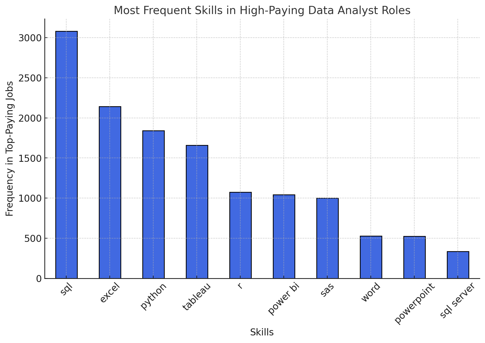

# Introduction

This small PostgreSQL project explores a job posting database to identify:

- Top-paying jobs & skills based on average annual salaries.

- High-demand skills by analyzing their occurrence in job postings.

The project utilizes SQL queries to aggregate and analyze data from job postings, linking salaries, skills, and demand.

🔎 You can check the SQL queries in [HERE](/project_sql/).

# Tools I used

- SQL
- PostgreSQL
- VsCode
- Git & GitHub

# The Analysis

Each query in this project was aimed at investigating specific aspects of the current job market:

### 1. Top Paying Data Analyst Jobs

```sql
SELECT
    jpf.job_id,
    cd.name AS company_name,
    jpf.job_title,
    jpf.job_location,
    jpf.job_schedule_type,
    jpf.salary_year_avg,
    jpf.job_posted_date
FROM
    job_postings_fact jpf
    JOIN company_dim cd ON cd.company_id = jpf.company_id
WHERE
    job_title_short = 'Data Analyst' AND
    salary_year_avg IS NOT NULL
ORDER BY
    salary_year_avg DESC
LIMIT 10
```

This query reveals the top 10 highest-paying Data Analyst jobs, highlighting key trends:

- Salary Range: Top salaries vary between $375,000 and $650,000, with Mantys offering the highest pay.

- Job Titles: High salaries are often tied to senior or specialized roles (e.g., Director of Safety Data Analysis).

### 2. Requested skills for top paying jobs

```sql
WITH top_paying_jobs AS (
    SELECT
        jpf.job_id,
        cd.name AS company_name,
        jpf.job_title,
        jpf.job_location,
        jpf.salary_year_avg
    FROM
        job_postings_fact jpf
        JOIN company_dim cd ON cd.company_id = jpf.company_id
    WHERE
        job_title_short = 'Data Analyst' AND
        salary_year_avg IS NOT NULL
    ORDER BY
        salary_year_avg DESC
)

SELECT
    tpj.*,
    sd.skills
FROM top_paying_jobs tpj
INNER JOIN skills_job_dim sjd ON tpj.job_id = sjd.job_id
INNER JOIN skills_dim sd ON sjd.skill_id = sd.skill_id
ORDER BY
    salary_year_avg DESC
```
This query reveals the most demanded skills for the top paying jobs presented before, as seen on the following graph:



### 3. Top Demanded Skills

The following query brings the most demanded skills for a Data Analyst worldwide.

```sql
SELECT
    skills,
    COUNT(skills_job_dim.job_id) AS skill_demand
FROM job_postings_fact jpf
INNER JOIN skills_job_dim ON jpf.job_id = skills_job_dim.job_id
INNER JOIN skills_dim ON skills_job_dim.skill_id = skills_dim.skill_id
WHERE
    jpf.job_title_short = 'Data Analyst'
GROUP BY
    skills
ORDER BY
    skill_demand DESC
LIMIT 5
```

| Skills   | Demand Count |
|----------|--------------|
| SQL      | 7291         |
| Excel    | 4611         |
| Python   | 4330         |
| Tableau  | 3745         |
| Power BI | 2609         |

- **SQL**, **Excel** and **Python** are still fundamental for a Data Analyst, being the top 3 most requested skills in job postings for this role.

- Visualization tools like **Power BI** and **Tableau** are also highly requested, being top 4 and 5 respectively.

### 4. Top Paying Skills

This query gets the top skills based on their average salary for Data Analysts.

```sql
SELECT
    skills,
    TRUNC(AVG(salary_year_avg), 2) AS average_salary
FROM job_postings_fact jpf
INNER JOIN skills_job_dim ON jpf.job_id = skills_job_dim.job_id
INNER JOIN skills_dim ON skills_job_dim.skill_id = skills_dim.skill_id
WHERE
    jpf.job_title_short = 'Data Analyst' AND
    jpf.salary_year_avg IS NOT NULL
GROUP BY
    skills
ORDER BY
    average_salary DESC
LIMIT 10
```

With this query we area able to find a more diverse result, with Cloud (Terraform, VMware) & A.I. (Couchbase, Datarobot) skills being more present.

### 5. Most optimal skills to learn

The objective with this query is to find what are the skills that have both a high demand and salary inside the Data Analyst job market.

```sql
SELECT 
    skills_dim.skill_id,
    skills_dim.skills,
    COUNT(skills_job_dim.job_id) AS demand_count,
    ROUND(AVG(job_postings_fact.salary_year_avg), 0) AS avg_salary
FROM job_postings_fact
INNER JOIN skills_job_dim ON job_postings_fact.job_id = skills_job_dim.job_id
INNER JOIN skills_dim ON skills_job_dim.skill_id = skills_dim.skill_id
WHERE
    job_title_short = 'Data Analyst'
    AND salary_year_avg IS NOT NULL
GROUP BY
    skills_dim.skill_id
HAVING
    COUNT(skills_job_dim.job_id) > 50
ORDER BY
    avg_salary DESC,
    demand_count DESC
LIMIT 25;
```

Once again, skills like **SQL** and **Python** are present, appearing in various high-paying job postings.

However, the skill with the best average salary is **Airflow**, with 71 postings and an average pay of $116387

# What I learned

Throughout this project, I not only strengthened my existing knowledge but also gained valuable new insights, particularly in advanced aggregation functions and joins.

I was especially pleased to discover that even the most complex problems and queries can be broken down into simpler, more efficient solutions and how I can achieve that.

# Conclusions

This project strengthened my SQL expertise and offered valuable perspectives on the data analyst job market. The insights gained from the analysis help in prioritizing skill development and job-hunting strategies. I can say that this exploration underscores the necessity of ongoing learning and staying adaptable to evolving trends.